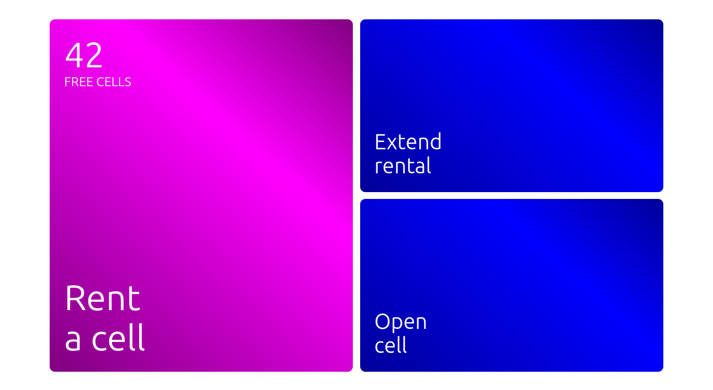

<p align="center">
  
</p>

<h1 align="center">Smart Locker Kiosk</h1>

<p align="center">
  Touchscreen kiosk frontend for automated storage locker management.<br/>
  Built with Vue 3, TypeScript, Pinia, and Vite.
</p>

<p align="center">
  
  
  
  
  
</p>

<p align="center">
  <a href="https://smart-locker-frontend.onrender.com/">Live Preview</a>
</p>

---

## Overview

Smart Locker Kiosk is a fullscreen single-page application designed for touchscreen kiosks at physical locker stations. It guides users through the complete rental lifecycle — from selecting a cell and making a payment, to retrieving their belongings.

The app communicates with two backend services: a **device controller API** for hardware operations (cell locks, barcode scanning) and a **data API** for cell state, pricing, and session management.

## Key Features

- **Cell Rental** — choose size (M / L / XL), set duration, enter phone number, pay via card terminal, receive SMS with PIN code
- **Rental Extension** — enter existing PIN, select additional time, pay the difference
- **Item Retrieval** — enter PIN or scan receipt barcode, confirm pickup, cell opens automatically
- **Penalty Handling** — automatic calculation of overdue fees when rental time has expired
- **Grace Period** — 5-minute window after rental where users can still add items to the cell
- **Animated Transitions** — smooth horizontal scroll-based page navigation without full reloads
- **On-Screen Keyboard** — custom numeric keyboard for PIN and phone number input
- **Payment Polling** — real-time status checks against the card terminal via API
- **SMS Notifications** — automatic sending of cell codes and rental confirmations
- **Mock Mode** — full offline development without hardware or backend dependencies

## Tech Stack

| Layer | Technology |
|---|---|
| Framework | [Vue 3](https://vuejs.org/) (Composition API with `<script setup>`) |
| State | [Pinia 4](https://pinia.vuejs.org/) |
| Language | [TypeScript 5.9](https://www.typescriptlang.org/) |
| Build | [Vite 8](https://vitejs.dev/) |
| Styling | Scoped SCSS with global utility classes |
| Linting | [ESLint 10](https://eslint.org/) + [eslint-plugin-vue 10](https://eslint.vuejs.org/) |
| Type Check | [vue-tsc 3](https://github.com/vuejs/language-tools) |
| Testing | [Vitest 4](https://vitest.dev/) + [happy-dom](https://github.com/capricorn86/happy-dom) |

## Architecture

### Navigation System

Instead of URL-based routing, the app uses a custom **Scroller** component — a horizontal sliding panel system. Pages are registered in a map and loaded as dynamic `<component :is>` targets. Transitions are handled via CSS scroll-position animation, providing a native-feeling slide effect on the kiosk display.

```
Global.vue
  └── Scroller.vue          ← page transition engine
        └── <component :is> ← dynamically loaded page
```

The `Ui` interface (`jump(page, direction?)`) is passed down to every page, giving each component the ability to navigate to any other page with an animated transition.

### Page Map

All 24 pages are lazily loaded and registered in `Scroller.vue`:

| Page | Purpose |
|---|---|
| `MainMenu` | Home screen — shows free cell count, entry point for all flows |
| `SelectCell` | Cell size selection (M / L / XL) with pricing |
| `SelectTimeStorage` | Rental duration picker |
| `Info` | Rental terms display |
| `InputPhone` | Phone number entry |
| `InputCode` | PIN code entry |
| `PayMethod` | Payment method selection |
| `Pay` | Card terminal payment with status polling |
| `Success` | Payment confirmed — SMS with code sent |
| `OpenCell` | Physical cell opened — add or take items |
| `Confirm` | Post-entry confirmation with grace period logic |
| `SizeCell` | Cell size selection for rental extension |
| `Scan` | Receipt barcode scanner |
| `LastConfirm` | Final confirmation before ending rental |
| `CompleteSuccess` | Rental completed successfully |
| `Penalty` | Overdue fee display and payment |
| `Timeout` | Rental timeout warning |
| `TimeoutSuccessPay` | Penalty paid successfully |
| `Warning` | Grace period expired warning |
| `NotEnoughMoney` | Insufficient funds screen |
| `BadCode` | Invalid PIN code |
| `InternalError` | System error with auto-redirect |
| `e1001` | SMS service unavailable error |

### API Layer

All API functions are defined in `src/api/index.ts`. Two backend services are used:

| Service | Env Variable | Purpose | Auth |
|---|---|---|---|
| **Data Server** | `VITE_DATA_SERVER` | Cell data, pricing, sessions, SMS | Session-based (`POST /login` with password) |
| **Device Server** | `VITE_API_SERVER` | Cell locks, barcode scanner | Direct (no auth) |

When `VITE_USE_MOCK=true`, every function returns deterministic mock data from `src/api/mock.ts`. Session tokens are cached in-memory with a 5-minute TTL. All requests have a 15-second timeout via `AbortController`.

#### Internal Helpers

| Function | Description |
|---|---|
| `ensureSession()` | Authenticates with the Data Server (`POST /login`), caches the session ID (`sid`) for 5 minutes |
| `_fetchWithTimeout(path, options?)` | `fetch` wrapper with 15s abort timeout and error logging |
| `load(path)` | Authenticated GET to Data Server (auto-calls `ensureSession`) |
| `loadHardware(path)` | Unauthenticated GET to Device Server |
| `getData()` | Merges device server cell list (`GET /boxs`) with data server state (`GET /get-data`), returns only active cells (`state === 1`) |
| `fsize(cell)` | Determines `SizeKey` from cell dimensions: `30×20→M`, `40×40→L`, `50×50→XL` |

#### Cell Data

| Function | Signature | Backend Endpoint | Mock Return | Description |
|---|---|---|---|---|
| `getFreeCellsCount` | `() → Promise<number>` | *(computed from getData)* | `42` | Count of cells without an active code |
| `getFreeSizes` | `() → Promise<FreeSizes>` | *(computed from getData)* | `{ XL: true, L: true, M: false }` | Which sizes have at least one free cell |
| `getFreeCellId` | `(size: SizeKey) → Promise<number \| undefined>` | *(computed from getData)* | `13` | First free cell ID matching the given size |
| `getSizeByCellId` | `(cellid: number) → Promise<SizeKey>` | `GET /boxs` | `'XL'` | Cell size for a specific cell ID |
| `getCellData` | `(cellid: number) → Promise<CellData>` | `GET /boxs` + `GET /get-data` | overdue cell data | Full cell info including phone, code, start/end timestamps |
| `getOccupiedCellsList` | `() → Promise<number[]>` | *(computed from getData)* | `[1, 2, 3]` | List of cell IDs with an active rental |

#### Pricing

| Function | Signature | Backend Endpoint | Mock Return | Description |
|---|---|---|---|---|
| `getPrice` | `(size: SizeKey) → Promise<number>` | `GET /get-price/{size}` | `1024` | Hourly price for a cell size |
| `invoice` | `(hours, size: SizeKey) → Promise<number>` | `GET /invoice/{hours}/{size}` | `69` | Total cost for a given duration and size |

#### Rental Operations

| Function | Signature | Backend Endpoint | Mock Return | Description |
|---|---|---|---|---|
| `beginStorage` | `({ phone, cellid, code, time }) → Promise<boolean>` | `GET /begin-storage/{phone}/{cellid}/{code}/{time}` | `true` | Start a new rental session |
| `endStorage` | `(cellid: number) → Promise<boolean>` | `GET /end-storage/{cellid}` | `true` | End an active rental |
| `extend` | `({ cellid, time }) → Promise<boolean>` | `GET /extend/{cellid}/{time}` | `true` | Extend an existing rental duration |
| `getTimes` | `(cellid: number) → Promise<TimeRange>` | `GET /get-times/{cellid}` | `{ start, end }` | Rental start/end timestamps (Unix seconds → `Date`) |
| `getPenaltyInfo` | `(cellid: number) → Promise<PenaltyInfo>` | `GET /get-penalty-info/{cellid}` | `{ timeout: '6h', penalty: 500 }` | Overdue duration and penalty amount |

#### Payment

| Function | Signature | Backend Endpoint | Mock Return | Description |
|---|---|---|---|---|
| `isPaid` | `(orderId: number) → Promise<string>` | `GET /is-paid/{orderId}` | `'wait'` × 5, then `'success'` | Poll card terminal for payment status |

#### Device Control

| Function | Signature | Backend Endpoint | Mock Return | Description |
|---|---|---|---|---|
| `open` | `(cellid: number) → Promise<void>` | `GET /boxs?bid={cellid}&cmd=open` | `void` | Unlock cell door. Retries 4 times with 500ms delay on failure |
| `startScan` | `() → Promise<unknown>` | `GET /start-scan` | `void` | Activate barcode scanner |
| `stopScan` | `() → Promise<unknown>` | `GET /stop-scan` | `void` | Deactivate barcode scanner |
| `scan` | `() → Promise<string \| null>` | `GET /scan` | `null` × 5, then `"2022"` | Read barcode; returns `null` while scanning, code string when read |

#### Communication

| Function | Signature | Backend Endpoint | Mock Return | Description |
|---|---|---|---|---|
| `sendSms` | `({ phone, text }) → Promise<boolean>` | `GET /send-sms/{phone}/{text}` | `true` | Send an SMS message to the given phone number |

#### TypeScript Interfaces

```ts
type SizeKey = 'M' | 'L' | 'XL'

interface HardwareCell {
  bid: number          // Cell ID
  section: number      // Physical section
  box: number          // Box number
  wpos: number[]       // Widget position
  name: string
  size: [number, number]  // Dimensions in cm [width, height]
  user_fi: string
  skey: number
  state: number        // -1 = inactive, 1 = active
  lock_r: number       // Lock state
  disabled: number     // 0 = enabled
  ts: number           // Timestamp
  phone?: string       // Renter's phone (set when occupied)
  code?: string        // PIN code (set when occupied)
  start?: Date         // Rental start
  end?: Date           // Rental end
}

interface CellData extends Partial<HardwareCell> {
  phone: string
  start: Date
  code: string
  end: Date
}

interface CheckCodeResult {
  status: string   // 'ok' | 'not found'
  cell: number     // Cell ID
}

interface PenaltyInfo {
  timeout: string  // e.g. '6h'
  penalty: number  // Penalty amount
}

interface TimeRange {
  start: Date
  end: Date
}

interface FreeSizes {
  M: boolean
  L: boolean
  XL: boolean
}
```

### State Management

A single Pinia store (`src/store.ts`) holds all cross-page state:

```ts
interface AppState {
  phone: string          // User's phone number
  cellid: number | null  // Selected cell ID
  size: SizeKey | null   // Cell size (M | L | XL)
  priceTotal: number     // Total price for the rental
  time: number | string | null  // Duration in hours
  caption: string        // UI caption text
  action: ActionType     // Current flow: 'begin' | 'extend' | 'complete' | ''
  text: string           // Status message
  back: string           // Back navigation target
  mainpage: { occupied: boolean; freeCells: number } | null
}
```

## Project Structure

```
src/
├── api/
│   └── index.ts            # API client — fetch, auth, mock data, all endpoints
├── assets/
│   ├── css/
│   │   ├── styles.scss      # Global styles + utility classes
│   │   └── _info-page.scss  # Shared info-page layout (used by 11 components)
│   └── img/
│       └── logo.svg
├── components/
│   ├── Error.vue            # Auto-redirecting error screen
│   ├── Global.vue           # Root layout — header area + scroller + footer
│   ├── NewKeyboard.vue      # On-screen keyboard (render function)
│   ├── PaddingBox.vue       # Spacing wrapper
│   ├── PageBody.vue         # Full-height page container
│   ├── PageHeader.vue       # Page title bar with icon
│   ├── ScrollBox.vue        # Paginated tile grid with arrow navigation
│   ├── Scroller.vue         # Core page transition engine
│   ├── SmallButton.vue      # Action button (primary / secondary / disabled)
│   └── Tile.vue             # Clickable card tile
├── pages/
│   ├── passForStorage/      # Rental flow sub-pages
│   │   ├── Info.vue
│   │   ├── OpenCell.vue
│   │   ├── Pay.vue
│   │   ├── PayMethod.vue
│   │   ├── SelectTimeStorage.vue
│   │   ├── SizeCell.vue
│   │   └── Success.vue
│   ├── Confirm.vue
│   ├── InputCode.vue
│   ├── InputPhone.vue
│   ├── MainMenu.vue
│   ├── Penalty.vue
│   ├── Scan.vue
│   └── ...                  # + 11 more page components
├── config.ts                # App constants (grace period, currency, phone prefix)
├── next.ts                  # Post-scan navigation logic
├── store.ts                 # Pinia store definition
├── types.ts                 # Shared TypeScript interfaces
├── App.vue                  # Root component
└── main.ts                  # Entry point
```

## Getting Started

### Prerequisites

- Node.js >= 20.19
- npm >= 10

### Install & Run

```bash
# Install dependencies
npm install

# Start dev server (port 8081, mock mode enabled by default)
npm run dev

# Production build
npm run build

# Preview production build
npm run preview
```

### Available Scripts

| Command | Description |
|---|---|
| `npm run dev` | Start Vite dev server on port 8081 |
| `npm run build` | Production build to `dist/` |
| `npm run preview` | Preview production build locally |
| `npm run lint` | Run ESLint on `src/` |
| `npm run type-check` | Run vue-tsc type checking |
| `npm run test:unit` | Run unit tests with Vitest |
| `npm run test:e2e` | Run e2e tests with Vitest + happy-dom |

## Environment Variables

Create a `.env` file in the project root (see `.env.example`):

```env
VITE_API_SERVER=http://your-server:8001/api/
VITE_DATA_SERVER=http://your-server:8666/
VITE_API_PASSWORD=your-password
VITE_USE_MOCK=true
```

| Variable | Description | Default |
|---|---|---|
| `VITE_API_SERVER` | Device controller API (cell locks, barcode scanner) | `http://localhost:8001/api/` |
| `VITE_DATA_SERVER` | Data API (cell state, pricing, sessions, SMS) | `http://localhost:8666/` |
| `VITE_API_PASSWORD` | Service account password for data API authentication | `admin` |
| `VITE_USE_MOCK` | Enable mock mode — returns fake data without a backend (`"true"` / `"false"`) | `true` |

When `VITE_USE_MOCK=true`, all API calls return deterministic mock responses. The payment flow simulates 5 polling attempts before returning success. The barcode scanner returns a code after 5 attempts. This allows full UI development and testing without any hardware or backend services.

## Error Codes

| Code | Meaning |
|---|---|
| **1001** | SMS service unavailable |
| **InternalError** | Generic system error — auto-redirects to MainMenu after 5 seconds |

## Design Details

### Kiosk-Optimized UI

- Fullscreen layout with no browser chrome
- Touch-friendly button sizes (minimum 3vh tap targets)
- Adaptive typography using `vw` / `vh` units for any screen size
- Primary actions styled in blue (`#000099`), accent elements in purple
- Fixed footer bar for contextual status messages

### Cell Sizes

| Size | Dimensions (cm) | Description |
|---|---|---|
| M | 30 × 20 | Small items |
| L | 40 × 40 | Medium items |
| XL | 50 × 50 | Large items |

### Rental Periods

| Constant | Value | Purpose |
|---|---|---|
| `springPeriod` | 5 min | Grace window after payment to add more items |
| `gracePeriod` | 15 min | Window after rental start for free cell access |

## License

MIT
